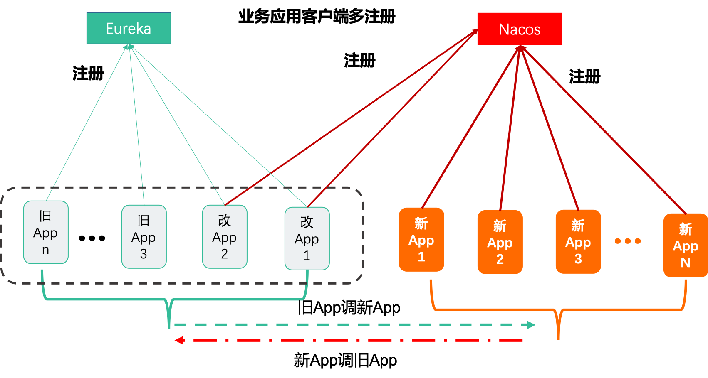
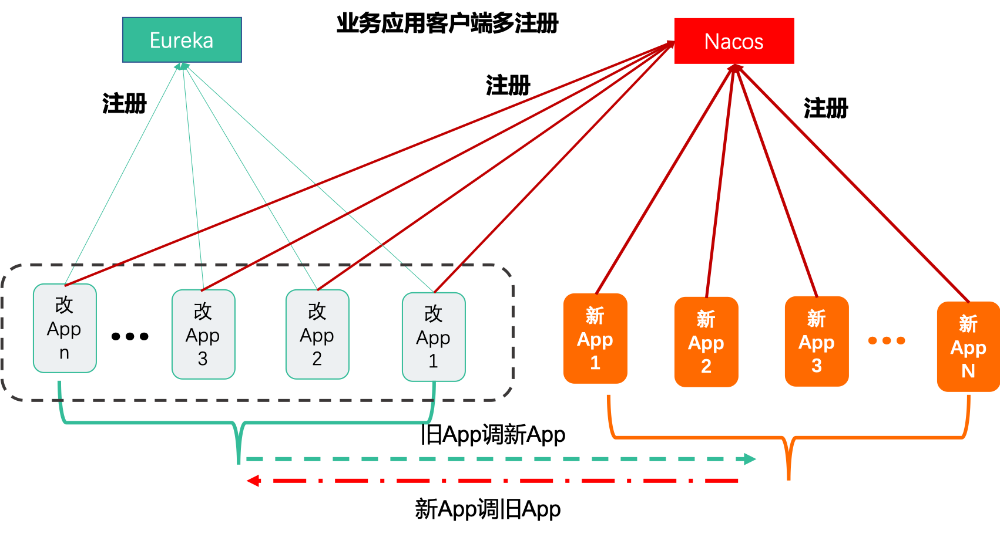
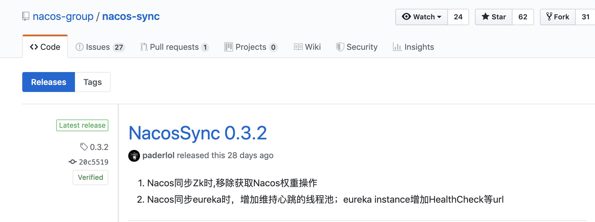
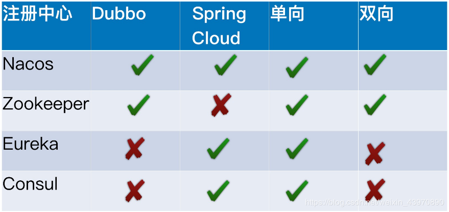
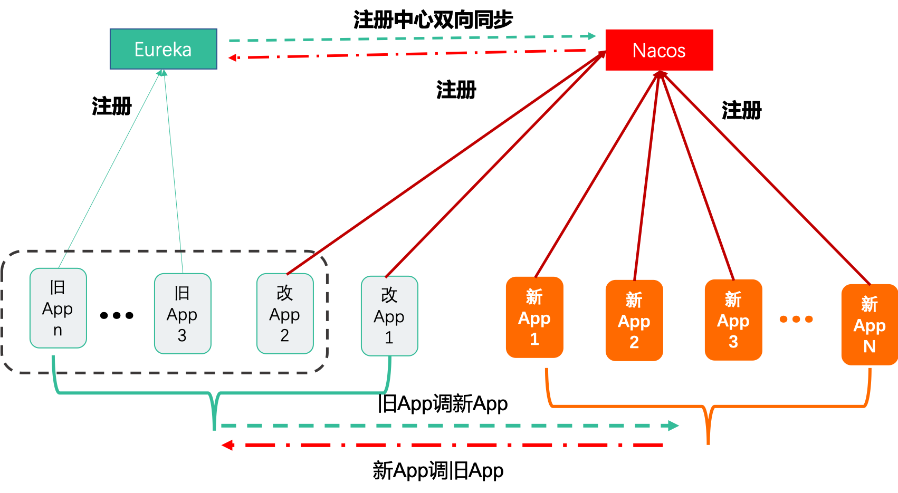
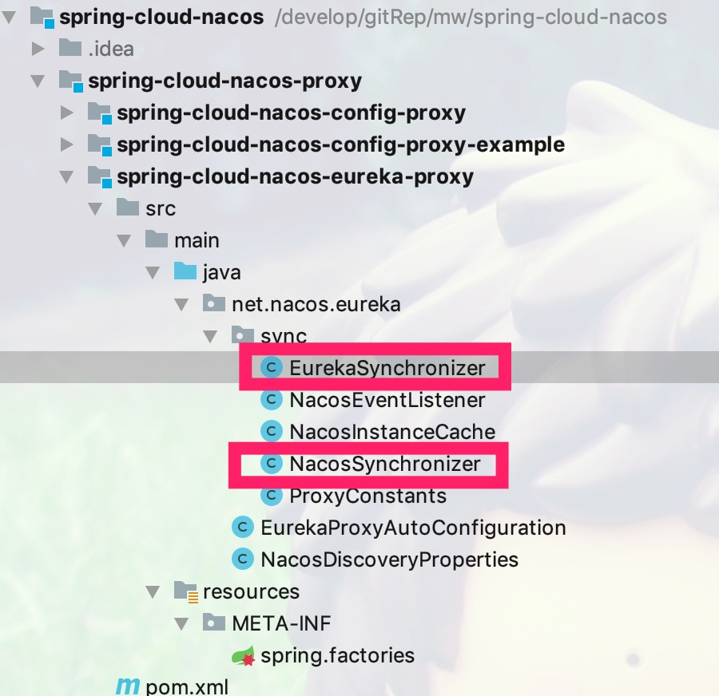

#  如何平滑迁移到Nacos？

#  如何平滑将注册中心从Eureka迁移到Nacos？
## 1.背景

注册中心需要从Eureka无缝平滑迁移到Nacos注册中心，业务方尽量改动最小，一次性搞定。

## 2.方案设计

### 2.1 业务应用多注册到Nacos和Eureka

Spring Cloud应用默认不支持启动时双向注册，但是阿里商业版上云组件支持。
也就是引入对应的组件，当应用启动的时候同时向Eureka和Nacos实现双向注册。


如上图所示，如果只把旧应用只改一部分，会出现只有改造的应用能调到新应用。未改造的应用会出现调不到新应用的情况。即，需要如下图所示的方式，旧应用全部升级改造为双注册到注册中心，才可以支持。


>但是旧应用无法保证同一时刻全部升级改造为同时注册，因此该方案论证失败。


### 2.2 Nacos Sync方案

Nacos Sync 是一个支持多种注册中心的同步组件，基于 SpringBoot 开发框架，数据层采用 Spring Data JPA，遵循了标准的 JPA 访问规范，支持多种数据源存储，默认使用 Hibernate 实现，更加方便的支持表的自动创建更新。但目前最新版本是，


0.4.0 规划介绍才支持Eureka与Nacos双向同步。下面表格介绍了目前支持的几种同步类型，并且说明了在 Dubbo 和 Spring Cloud 下是否支持同步，表格中列举的几种注册中心，无论单向还是双向同步都是在和 Nacos 进行交互。


>从上图中可以知道，目前不支持Nacos与Eureka双向同步。不支持双向同步，不建议使用。

### 2.3 注册中心服务端双向同步

#### 2.3.1 方案设计

设计思路是注册中心服务端进行双向同步，做到微服务端完全无侵入，可以随业务迭代逐步完成升级和迁移。改造Eureka Server，Eureka Server引入同步组件实现Nacos和Eureka之间实现双向同步，如下图所示：



##### 2.3.2 迁移步骤

迁移步骤如下:
1.部署Nacos Server集群用于服务注册与发现
2.在线动态扩容Eureka Server，替换其中的1-2两台Eureka Server。
3.逐渐改造旧应用，只需将新旧应用注册到Nacos上
4.等旧应用全部改造完毕，下线Eureka Server即可。

这样方案的优点，如下:
* 1.新应用直接注册到Nacos上，不需要同时注册到Eureka和Nacos上
* 2.旧应用直接改造(引入相关starter即可)注册到Nacos上即可，不需要同时注册到Nacos和Eureka上
* 3.。
* 4.迁移成本很低，旧应用只需改造一次(所谓的改造即引入新的Starter，修改配置)，等全部迁移完毕，直接下线Eureka Server。


### 2.4 三种方案的对比

| 方案 | 优点 | 缺点 |是否推荐
| --- | --- | --- |---
|由Eureka进行双向同步|1.业务方应用只需改造一次 2.即使旧应用没有时间改造，依然注册到Eureka上也可以服务发现Nacos上的新服务或者迁移过去的新服务 |需要改造注册中心 |推荐
|多注册到Nacos和Eureka| 就是不需要改造注册中心，由业务方应用启动双向注册 | 1.增加旧业务方应用的改造成本。2. 旧应用需要多次改造 当下线Eureka Server时，需要保证全部旧应用全部已经注册到Nacos上。3.Eureka Server下线瞬间，只允许从Nacos上进行服务与发现调用|不推荐

## 3.迁移落地

### 3.1 组件开发

组件采用SpringBoot自动配置方式构建，需要在pom文件中添加组件的依赖，并且在项目中添加Nacos的配置文件，Spring Boot在启动时，会自动加载配置。

* Eureka注册中心
```
<dependency>
    <groupId>net.nacos</groupId>
    <artifactId>spring-cloud-nacos-eureka-proxy</artifactId>
    <version>1.0.0</version>
</dependency>
```

* Spring Cloud Config配置中心
```
<dependency>
    <groupId>net.nacos</groupId>
    <artifactId>spring-cloud-nacos-config-proxy</artifactId>
    <version>1.0.0</version>
</dependency>
```
* application.properties配置文件
```
spring.cloud.nacos.config.serverAddr=localhost:8848
```

### 3.3 spring-cloud-nacos组件介绍

核心代码主要是NacosSynchronizer.java和EurekaSynchronizer.java,请自行阅读。
github地址:https://github.com/inacos/spring-cloud-nacos


## 4.实现迁移落地

按如下，迁移步骤进行迁移。具体细节在本文省略。
1.部署Nacos Server集群用于服务注册与发现
2.在线动态扩容Eureka Server，替换其中的1-2两台Eureka Server。
3.逐渐改造旧应用，只需将新旧应用注册到Nacos上
4.等旧应用全部改造完毕，下线Eureka Server即可。

### 4.1  在线扩容Eureka Server

在Eureka Server中引入

## 5.总结

#  如何平滑将配置中心从Spring Cloud Config迁移到Nacos？

相对于注册中心平滑迁移来说，配置中心的迁移简单得多。多亏了Spring Cloud优秀的设计，其灵活扩展能力极强，我们只用将Spring Cloud Config底层存储切换到Nacos即可（参考NacosEnvironmentRepository），将Spring Cloud Config变成Nacos的一个Proxy。

具体代码参考spring-cloud-nacos-config-proxy-example项目，只需在原有的Spring Cloud Config添加依赖即可:

```
<dependency>
    <groupId>net.nacos</groupId>
    <artifactId>spring-cloud-nacos-config-proxy</artifactId>
    <version>1.0.0</version>
</dependency>
<dependency>
    <groupId>com.alibaba.nacos</groupId>
    <artifactId>nacos-client</artifactId>
    <version>1.1.3</version>
</dependency>
```
启动spring-cloud-nacos-config-proxy-example

假设微服务名为demo，启动参数为:
````
--spring.cloud.config.uri=http://localhost:8888
--spring.application.name=demo
--spring.cloud.config.profile=dev
--spring.cloud.config.fail-fast=true
````
那么我们的spring-cloud-nacos-config-proxy-example会从Nacos读取DataId为application.properties、application-dev.properties、demo.properties、demo-dev.properties四个配置，并且优先级由低至高，符合Spring Cloud Config规范。

如果想在Nacos里使用yml文件配置，只需添加spring-cloud-nacos-config-proxy-example配置：
```
# 默认properties
spring.cloud.nacos.config.fileExtension=yml
```


